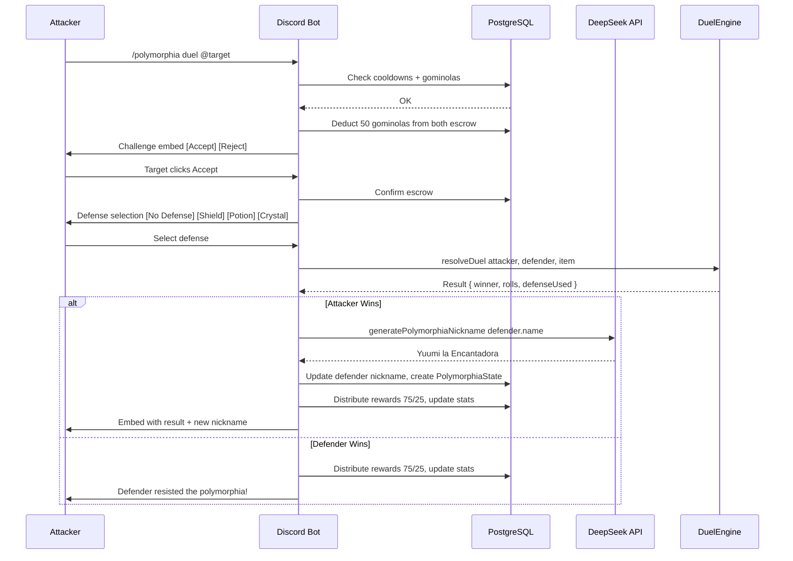

# Polymorphia — Complete Architecture Plan

## Executive Summary

This document describes the full architecture for transforming the current `/polymorphia` command (a one-shot nickname changer where the attacker always wins) into a full-featured **duel minigame** with defense items, cooldowns, rewards, and interactive components.

---

## Critical Finding: Schema Mismatch

The existing [`polymorphiaSweeper.js`](../apps/minigames-bot/src/services/polymorphiaSweeper.js) references fields that **do not currently exist** in the [`PolymorphiaState`](../packages/database/prisma/schema.prisma:93) model:

| Reference in Sweeper | Current Schema | Status |
|---|---|---|
| `state.guildId` | Not present | ❌ Missing |
| `state.previousNickname` | Not present | ❌ Missing |
| `state.user.discordId` | User has `id` (the snowflake), not `discordId` | ❌ Mismatch |

**The sweeper was already written for a future schema.** The Prisma schema update is a prerequisite for everything.

---

## 1. Folder Structure — Modular Layout

Current flat structure will be extended with a dedicated `polymorphia/` module:

```
apps/minigames-bot/
├── index.js                              # Entry point — unchanged, already clean
│
├── commands/
│   ├── utility/
│   │   ├── ping.js                       # Unchanged
│   │   └── catch.js                      # Unchanged
│   └── polymorphia/                      # NEW: Polymorphia command group
│       └── index.js                      # Router: /polymorphia [duel|shop|inventory|stats|defend]
│
├── events/
│   └── client/
│       ├── interactionCreate.js          # MODIFIED: route component interactions to polymorphia
│       ├── messageCreate.js              # Unchanged (butterfly spawner)
│       └── ready.js                      # MODIFIED: start polymorphia services
│
├── src/
│   ├── handlers/
│   │   ├── commandHandler.js             # MODIFIED: load subdirectory commands (polymorphia/)
│   │   └── eventHandler.js               # Unchanged
│   │
│   ├── services/
│   │   ├── database.js                   # MODIFIED: new DB helpers for polymorphia
│   │   ├── deepseek.js                   # Unchanged
│   │   ├── butterfly.js                  # Unchanged
│   │   └── polymorphiaSweeper.js         # Already exists — will work after schema update
│   │
│   └── polymorphia/                      # NEW: Polymorphia core logic
│       ├── DuelEngine.js                 # Core duel math, dice rolls, modifiers
│       ├── ItemDefense.js                # Defense item validation & application
│       ├── CooldownManager.js            # Cooldown & protection logic
│       └── RewardManager.js              # Gominolas distribution & stat tracking
```

### Why this structure?

- **Separation of concerns**: Game logic lives in `src/polymorphia/`, command routing in `commands/polymorphia/`, not mixed.
- **Existing services untouched**: `butterfly.js`, `deepseek.js` remain independent.
- **Gradual migration path**: Old `commands/utility/polymorphia.js` is deleted; the new `commands/polymorphia/index.js` replaces it.

---

## 2. Prisma Schema — Required Updates

### Model: `PolymorphiaState`

Fields to **add** (the sweeper already depends on these):

```prisma
model PolymorphiaState {
  id              String   @id @default(cuid())
  userId          String   @unique
  user            User     @relation(fields: [userId], references: [id], onDelete: Cascade)

  // === Current State (existing, used) ===
  isActive        Boolean  @default(false)
  currentForm     String   @default("")
  formDuration    Int      @default(0)       // minutes
  startedAt       DateTime?
  endsAt          DateTime?

  // === NEW: Sweeper dependencies ===
  guildId         String?                     // Which guild the polymorphia happened in
  previousNickname String?                    // Original nickname to restore on expiry

  // === NEW: Polymorphia duel stats ===
  polymorphiaWins     Int    @default(0)      // Times user won a polymorphia duel
  polymorphiaLosses   Int    @default(0)      // Times user was polymorphed
  polymorphiaDefended Int    @default(0)      // Times user successfully defended

  // === Butterfly hunt stats (existing) ===
  butterfliesCaught   Int    @default(0)
  totalButterflies    Int    @default(0)

  createdAt       DateTime @default(now())
  updatedAt       DateTime @updatedAt
}
```

### Model: `User`

Fields to **add** for cooldown tracking:

```prisma
model User {
  // ... existing fields ...

  // === NEW: Cooldown & Protection ===
  lastPolymorphiaUse      DateTime?            // For initiator cooldown 10 min
  polymorphiaProtectedUntil DateTime?           // For target protection 4 hours
}
```

### Model: `Item`

**No changes needed.** The existing `Item` model already supports:
- `category`: "defense" | "consumable" | "form" | "butterfly"
- `rarity`: "common" | "uncommon" | "rare" | "epic" | "legendary"
- `price`: cost in gominolas
- `isCollectible`: for butterfly collectibles

### New Seed Items

Add to [`packages/database/prisma/seed.ts`](../packages/database/prisma/seed.ts):

```typescript
// Defensive items for Polymorphia
{ name: "Escudo de Banshee",      emoji: "🛡️", category: "defense",   rarity: "rare",     price: 150, isCollectible: false },
{ name: "Cetro de Cristal",       emoji: "🔮", category: "defense",   rarity: "epic",     price: 300, isCollectible: false },
{ name: "Poción de Polvo de Hada",emoji: "🧴", category: "consumable", rarity: "common",  price: 40,  isCollectible: false },
```

### Migration Command

```bash
npx prisma migrate dev --name add-polymorphia-fields -w packages/database
```

---

## 3. Duel Flow — Phase 1 Detailed Design

### 3.1 Command: `/polymorphia duel @target`

```
┌─────────────────────────────────────────────────────────────────┐
│  STEP 1: INITIATION                                             │
│  User runs /polymorphia duel @target                            │
│                                                                 │
│  ┌─ Validations ──────────────────────────────────────────────┐ │
│  │ ✓ Cannot target self                                       │ │
│  │ ✓ Cannot target bots                                       │ │
│  │ ✓ Initiator not on cooldown (10 min since last use)       │ │
│  │ ✓ Target not under protection (4h since last polymorphia) │ │
│  │ ✓ Both users have >= 50 gominolas                         │ │
│  │ ✓ Bot has ManageNicknames permission                       │ │
│  │ ✓ Bot role > target role                                   │ │
│  └─────────────────────────────────────────────────────────────┘ │
│                                                                 │
│  On success: Deduct 50 gominolas from BOTH (held in escrow)    │
│  Send challenge embed → [Accept Duel] [Reject Duel] buttons     │
└─────────────────────────────────────────────────────────────────┘
```

### 3.2 Interaction: Target Responds

```
┌─────────────────────────────────────────────────────────────────┐
│  STEP 2: ACCEPTANCE                                             │
│                                                                 │
│  [Accept Duel] clicked:                                         │
│  ├─ Escrow confirmed (50 gominolas deducted from each)         │
│  ├─ Send defense selection embed                                │
│  │   [No Defense: flat roll]                                    │
│  │   [Use: Escudo de Banshee] (block, one-time consume)        │
│  │   [Use: Poción de Polvo de Hada] (+3 to roll, consume)     │
│  │   [Use: Cetro de Cristal] (halve duration, passive)         │
│  │   (15s timeout → auto = No Defense)                         │
│  └─ After selection → resolve duel                             │
│                                                                 │
│  [Reject Duel] clicked:                                         │
│  ├─ Both users get their 50 gominolas back                      │
│  ├─ Embed: "X declined the duel like a coward!"                 │
│  └─ Duel ends                                                   │
│                                                                 │
│  Timeout 60s no response:                                       │
│  ├─ Both users get their 50 gominolas back                      │
│  ├─ Embed: "The challenge expired..."                           │
│  └─ Duel ends                                                   │
└─────────────────────────────────────────────────────────────────┘
```

### 3.3 Duel Resolution Logic — `DuelEngine.js`

```javascript
// DuelEngine.js — Core math

function resolveDuel(attacker, defender, defenseItem) {
  const attackerRoll = rollD20() + getModifiers(attacker)
  const defenderRoll = rollD20() + getModifiers(defender) + getDefenseBonus(defenseItem)

  if (attackerRoll > defenderRoll) {
    return {
      winner: 'attacker',
      attackerRoll,
      defenderRoll,
      defenseUsed: defenseItem?.name || null,
      blockedByShield: defenseItem?.name === 'Escudo de Banshee'
        ? Math.random() < 0.5  // 50% block chance
        : false
    }
  }

  // Defender wins (tie goes to defender)
  return {
    winner: 'defender',
    attackerRoll,
    defenderRoll,
    defenseUsed: defenseItem?.name || null,
    blockedByShield: false
  }
}

function rollD20() {
  return Math.floor(Math.random() * 20) + 1
}

function getModifiers(user) {
  let bonus = 0
  if (user.veteranRole) bonus += 2           // "Invocador Veterano" role
  bonus += Math.min(user.polymorphiaWins, 5) // +1 per win, cap at +5
  return bonus
}

function getDefenseBonus(item) {
  if (!item) return 0
  switch (item.name) {
    case 'Poción de Polvo de Hada': return 3
    case 'Cetro de Cristal':        return 1  // Also halves duration
    case 'Escudo de Banshee':       return 0  // Block chance is separate
    default: return 0
  }
}
```

### 3.4 Reward Distribution — `RewardManager.js`

```
┌─ Attacker Wins ──────────────────────────────────────────────────┐
│  Attacker receives:  75 gominolas  (profit: +25 net)            │
│  Defender receives:  25 gominolas  (loss:  -25 net)             │
│                                                                 │
│  Effects:                                                        │
│  ├─ Call DeepSeek → generate polymorphia nickname               │
│  ├─ Set defender's nickname                                     │
│  ├─ Create PolymorphiaState:                                    │
│  │   isActive=true, guildId, previousNickname,                   │
│  │   formDuration=random(30-120min), endsAt=now+duration        │
│  ├─ polymorphiaWins++ (attacker)                                │
│  ├─ polymorphiaLosses++ (defender)                              │
│  └─ If Escudo de Banshee active → block nickname change         │
│     (attacker still wins gominolas, but defender keeps name)    │
│     → polymorphiaDefended++ (defender)                          │
└─────────────────────────────────────────────────────────────────┘

┌─ Defender Wins ──────────────────────────────────────────────────┐
│  Defender receives:  75 gominolas  (profit: +25 net)             │
│  Attacker receives:  25 gominolas  (loss:  -25 net)              │
│                                                                 │
│  Effects:                                                        │
│  ├─ No nickname change                                           │
│  ├─ polymorphiaDefended++ (defender)                             │
│  ├─ polymorphiaLosses++ (attacker)                               │
│  └─ Embed: "X resisted the polymorphia! The magic rebounds!"     │
└─────────────────────────────────────────────────────────────────┘
```

### 3.5 Sweeper Integration

The [`polymorphiaSweeper.js`](../apps/minigames-bot/src/services/polymorphiaSweeper.js) already handles:

- Querying expired `PolymorphiaState` records (`isActive=true, endsAt <= now`)
- Reverting nicknames to `previousNickname`
- Marking states as inactive

**No changes needed** to the sweeper once the schema is updated with `guildId`, `previousNickname`.

---

## 4. Item Defense System — Phase 2 Detail

### 4.1 Item Catalog

| Item | Category | Rarity | Price | Effect | Consumed? |
|---|---|---|---|---|---|
| Escudo de Banshee | defense | rare | 150 | 50% chance to block nickname change (attacker still wins gominolas) | Yes |
| Cetro de Cristal | defense | epic | 300 | Halves polymorphia duration +1 to defense roll (passive) | No |
| Poción de Polvo de Hada | consumable | common | 40 | +3 to defense roll | Yes |

### 4.2 Defense Selection Flow

```javascript
// ItemDefense.js

const DEFENSE_ITEMS = {
  'escudo_de_banshee': {
    name: 'Escudo de Banshee',
    effect: 'block',
    blockChance: 0.5,
    consumed: true,
    description: '50% chance to block the nickname change'
  },
  'cetro_de_cristal': {
    name: 'Cetro de Cristal',
    effect: 'halve_duration',
    rollBonus: 1,
    consumed: false,
    description: 'Halves polymorphia duration +1 to defense roll'
  },
  'pocion_polvo_hada': {
    name: 'Poción de Polvo de Hada',
    effect: 'roll_bonus',
    rollBonus: 3,
    consumed: true,
    description: '+3 to your defense roll'
  }
}

function getOwnedDefenseItems(userId) {
  // Query UserItem joined with Item where category IN ['defense', 'consumable']
  // Return items with quantity > 0
}

function consumeItem(userId, itemName) {
  // Decrement UserItem.quantity, delete if quantity reaches 0
}
```

### 4.3 Shop Commands

```
/polymorphia shop
  → Shows all purchasable items with prices
  → Each item has a [Buy] button
  → On buy: check gominolas, deduct, create UserItem record

/polymorphia inventory [@user]
  → Shows all items owned by user, grouped by category
  → Shows quantity for each

/polymorphia stats [@user]
  → Shows polymorphia duel record (W/L/D, total duels)
  → Shows current form if polymorphed
  → Shows butterfly hunting stats
```

---

## 5. Cooldown System — Phase 3 Detail

### 5.1 Rules

| Rule | Constraint | Field | Enforcement |
|---|---|---|---|
| Duel cooldown | 10 min between initiating duels | `User.lastPolymorphiaUse` | Check in command handler |
| Target protection | 4h between being targeted | `User.polymorphiaProtectedUntil` | Check in command handler |
| Daily limit | Max 5 duels initiated per day | Computed from `PolymorphiaState.polymorphiaWins + losses` in last 24h | Check in command handler |

### 5.2 `CooldownManager.js`

```javascript
// CooldownManager.js

const DUEL_COOLDOWN_MS = 10 * 60 * 1000        // 10 minutes
const PROTECTION_MS = 4 * 60 * 60 * 1000        // 4 hours
const DAILY_LIMIT = 5

async function canInitiateDuel(userId) {
  const user = await prisma.user.findUnique({ where: { id: userId } })

  if (!user.lastPolymorphiaUse) return { allowed: true }

  const elapsed = Date.now() - user.lastPolymorphiaUse.getTime()
  if (elapsed < DUEL_COOLDOWN_MS) {
    const remaining = Math.ceil((DUEL_COOLDOWN_MS - elapsed) / 1000 / 60)
    return {
      allowed: false,
      reason: `cooldown`,
      remainingMinutes: remaining
    }
  }

  // Check daily limit
  const last24h = new Date(Date.now() - 24 * 60 * 60 * 1000)
  const recentDuels = await prisma.polymorphiaState.findMany({
    where: {
      userId,
      updatedAt: { gte: last24h }
    }
  })
  // ... count logic

  return { allowed: true }
}

async function canBeTargeted(userId) {
  const user = await prisma.user.findUnique({ where: { id: userId } })

  if (!user.polymorphiaProtectedUntil) return { allowed: true }

  if (user.polymorphiaProtectedUntil > new Date()) {
    return {
      allowed: false,
      reason: `protection`,
      until: user.polymorphiaProtectedUntil
    }
  }

  return { allowed: true }
}

async function applyCooldowns(attackerId, defenderId) {
  await prisma.user.update({
    where: { id: attackerId },
    data: {
      lastPolymorphiaUse: new Date()
    }
  })

  await prisma.user.update({
    where: { id: defenderId },
    data: {
      polymorphiaProtectedUntil: new Date(Date.now() + PROTECTION_MS)
    }
  })
}
```

---

## 6. Interaction Routing — Updated `interactionCreate.js`

The current [`interactionCreate.js`](../apps/minigames-bot/events/client/interactionCreate.js) only handles `butterfly_catch:` buttons. It needs to also route polymorphia component interactions.

```javascript
// Updated interactionCreate.js

module.exports = {
  name: 'interactionCreate',
  async execute(interaction, client) {
    // Route polymorphia component interactions
    if (interaction.isButton() || interaction.isAnySelectMenu()) {
      const polymorphiaPrefixes = [
        'polymorphia_accept',
        'polymorphia_reject',
        'polymorphia_defense',
        'polymorphia_shop_buy'
      ]

      if (polymorphiaPrefixes.some(p => interaction.customId.startsWith(p))) {
        const { handlePolymorphiaInteraction } = require('#services/polymorphiaInteractions')
        return handlePolymorphiaInteraction(interaction, client)
      }
    }

    // Route butterfly catch buttons (existing)
    if (interaction.isButton() && interaction.customId.startsWith('butterfly_catch:')) {
      return handleButterflyCatch(interaction, client)
    }

    // Slash commands (existing)
    if (!interaction.isChatInputCommand()) return
    // ... rest unchanged
  }
}
```

---

## 7. Database Service — New Helpers

New functions to add to [`database.js`](../apps/minigames-bot/src/services/database.js):

```javascript
// Polymorphia duel helpers
async function createPolymorphiaState(userId, guildId, previousNickname, currentForm, durationMinutes) { /* ... */ }
async function expirePolymorphiaState(userId) { /* ... */ }
async function recordDuelResult(winnerId, loserId, isDefended) { /* ... */ }
async function getPolymorphiaStats(userId) { /* ... */ }

// Item helpers
async function getUserItems(userId) { /* ... */ }
async function purchaseItem(userId, itemName) { /* ... */ }
async function consumeUserItem(userId, itemName) { /* ... */ }

// Cooldown helpers
async function applyCooldowns(attackerId, defenderId) { /* ... */ }
async function canInitiateDuel(userId) { /* ... */ }
async function canBeTargeted(userId) { /* ... */ }
```

---

## 8. Implementation Roadmap

### Phase 0: Prisma Schema Update

| Step | File | Description |
|------|------|-------------|
| 0.1 | [`schema.prisma`](../packages/database/prisma/schema.prisma) | Add `guildId`, `previousNickname`, `polymorphiaWins/Losses/Defended` to `PolymorphiaState` |
| 0.2 | [`schema.prisma`](../packages/database/prisma/schema.prisma) | Add `lastPolymorphiaUse`, `polymorphiaProtectedUntil` to `User` |
| 0.3 | [`seed.ts`](../packages/database/prisma/seed.ts) | Add 3 new defense/consumable items |
| 0.4 | Terminal | Run `npx prisma migrate dev` and `npx prisma db seed` |

### Phase 1: Command Handler Refactor + Duel System

| Step | File | Description |
|------|------|-------------|
| 1.1 | [`commandHandler.js`](../apps/minigames-bot/src/handlers/commandHandler.js) | Support subdirectory command loading (e.g., `polymorphia/index.js`) |
| 1.2 | `commands/polymorphia/index.js` | Create polymorphia command group with `duel` subcommand |
| 1.3 | `src/polymorphia/DuelEngine.js` | Dice roll + modifier logic |
| 1.4 | `src/polymorphia/RewardManager.js` | Escrow, gominola distribution, stat updates |
| 1.5 | `src/polymorphia/CooldownManager.js` | Cooldown + protection checks |
| 1.6 | [`database.js`](../apps/minigames-bot/src/services/database.js) | Add polymorphia DB helpers |
| 1.7 | [`interactionCreate.js`](../apps/minigames-bot/events/client/interactionCreate.js) | Route polymorphia component interactions |
| 1.8 | **DELETE** `commands/utility/polymorphia.js` | Remove old command |

### Phase 2: Items + Defense System

| Step | File | Description |
|------|------|-------------|
| 2.1 | `src/polymorphia/ItemDefense.js` | Defense item logic, consumption, validation |
| 2.2 | `commands/polymorphia/index.js` | Add `shop`, `inventory`, `defend` subcommands |
| 2.3 | [`database.js`](../apps/minigames-bot/src/services/database.js) | Add item purchase/consume helpers |

### Phase 3: Stats + UI Polish

| Step | File | Description |
|------|------|-------------|
| 3.1 | `commands/polymorphia/index.js` | Add `stats` subcommand with embed |
| 3.2 | Various | Add colorful embeds, progress bars for cooldowns |

---

## 9. Data Flow Diagram



---

## 10. Edge Cases & Error Handling

| Scenario | Handling |
|---|---|
| Target leaves server during duel | Cancel duel, refund both, send error ephemeral |
| Bot loses ManageNicknames after duel starts | Catch error, refund both, notify both users |
| DeepSeek API timeout | Fallback to a local pool of ~20 predefined nicknames |
| User has 0 gominolas but tries to duel | Reject with "Necesitas al menos 50 gominolas!" |
| Target is already polymorphed | Reject: "X ya está bajo un efecto de polimorfia!" |
| Concurrent duels with same target | First to accept locks the target; second gets "already in a duel" |
| Item quantity reaches 0 after consumption | Delete UserItem record or set quantity=0 |
| Race condition on escrow deduction | Use Prisma `$transaction` for atomicity |
