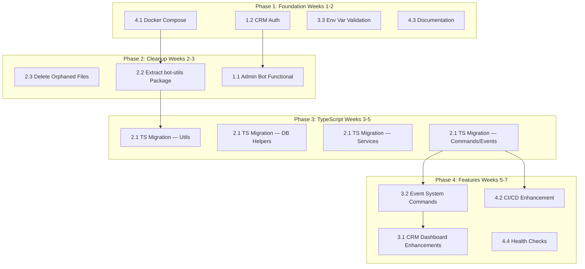

# Lulu Discord Suite — Project Improvement Roadmap

> Generated: 2026-07-19 | Scope: Full monorepo assessment across all 3 apps + shared package

---

## Table of Contents

1. [Critical — Immediate Action](#1-critical--immediate-action)
2. [High — Structural & Consistency](#2-high--structural--consistency)
3. [Medium — Feature Gaps](#3-medium--feature-gaps)
4. [Low — Infrastructure & Developer Experience](#4-low--infrastructure--developer-experience)
5. [Execution Order & Dependencies](#5-execution-order--dependencies)

---

## 1. Critical — Immediate Action

### 1.1 Admin Bot: From Placeholder to Functional

**Current state:** [`admin-bot`](apps/admin-bot/) has 2 commands (`/admin-ban`, `/admin-config`) that only return placeholder text. No DB integration, no logger, no rate limiting, no tests.

**Target:** A fully operational admin bot that leverages the shared `@lulu-discord/database` package and `GuildConfig` model.

#### Action Items

| Step | File(s) | Description |
|------|---------|-------------|
| 1.1.1 | [`admin-bot/package.json`](apps/admin-bot/package.json) | Add dependencies: `pino`, `pino-pretty` (match minigames logging), `dotenv` (already present) |
| 1.1.2 | `apps/admin-bot/src/utils/logger.js` | Create pino logger (mirror [`logger.js`](apps/minigames-bot/src/utils/logger.js)) |
| 1.1.3 | `apps/admin-bot/src/utils/RateLimiter.js` | Create rate limiter (mirror [`RateLimiter.js`](apps/minigames-bot/src/utils/RateLimiter.js)) |
| 1.1.4 | [`admin-bot/commands/admin/ban.js`](apps/admin-bot/commands/admin/ban.js) | Implement real ban: call `interaction.guild.members.ban()` with reason, log to logChannel from `GuildConfig` |
| 1.1.5 | [`admin-bot/commands/admin/config.js`](apps/admin-bot/commands/admin/config.js) | Implement real config: read/write `GuildConfig` via shared `guildConfig.js` helpers (port or share from minigames) |
| 1.1.6 | `apps/admin-bot/commands/admin/prune.js` | Implement message purge: `channel.bulkDelete(count)` |
| 1.1.7 | `apps/admin-bot/commands/admin/ping.js` | Already exists — verify and enhance with DB latency |
| 1.1.8 | `apps/admin-bot/commands/admin/view-user.js` | New command: show user stats, balance, polymorphia state, recent transactions (reuse `admin.js` services from minigames) |
| 1.1.9 | `apps/admin-bot/commands/admin/adjust-balance.js` | New command: admin candy adjustment with transaction audit |
| 1.1.10 | `apps/admin-bot/commands/admin/reset-cooldown.js` | New command: clear polymorphia cooldowns for a user |
| 1.1.11 | `apps/admin-bot/commands/admin/force-unpolymorphia.js` | New command: force-remove polymorphia from a user |
| 1.1.12 | [`admin-bot/src/handlers/commandHandler.js`](apps/admin-bot/src/handlers/commandHandler.js) | Upgrade to match minigames: pino logging, `index.js` subdirectory support |
| 1.1.13 | [`admin-bot/events/client/interactionCreate.js`](apps/admin-bot/events/client/interactionCreate.js) | Add rate limiting (mirror minigames pattern) |
| 1.1.14 | `apps/admin-bot/__tests__/` | Add Vitest config + basic tests for commands |

#### Architecture Decision

**Option A (recommended):** Extract shared bot utilities into a new `packages/bot-utils` package:
- `commandHandler.js`
- `eventHandler.js`
- `RateLimiter.js`
- `logger.js` (or just standardize on pino)
- `guildConfig.js`

**Option B:** Keep duplication but ensure both bots follow identical patterns.

> Choose Option A for long-term maintainability.

---

### 1.2 CRM Dashboard: Add Authentication

**Current state:** All pages and API routes are public. Anyone with the URL can view guild stats, user data, and leaderboards.

**Target:** Require authentication to access any dashboard page or API route.

#### Action Items

| Step | File(s) | Description |
|------|---------|-------------|
| 1.2.1 | [`crm-dashboard/package.json`](apps/crm-dashboard/package.json) | Add `next-auth` (or `@auth/core` + `@auth/prisma-adapter`) |
| 1.2.2 | `apps/crm-dashboard/lib/auth.ts` | Configure NextAuth with Discord OAuth2 provider |
| 1.2.3 | `apps/crm-dashboard/app/api/auth/[...nextauth]/route.ts` | Create NextAuth API route handler |
| 1.2.4 | `apps/crm-dashboard/middleware.ts` | Add middleware: redirect unauthenticated users to login, protect `/dashboard/*` and `/api/*` routes |
| 1.2.5 | `apps/crm-dashboard/app/login/page.tsx` | Create login page with Discord sign-in button |
| 1.2.6 | [`packages/database/prisma/schema.prisma`](packages/database/prisma/schema.prisma) | Add NextAuth models: `Account`, `Session`, `VerificationToken` |
| 1.2.7 | `apps/crm-dashboard/app/dashboard/layout.tsx` | Add session check in layout, display user avatar + name |
| 1.2.8 | `apps/crm-dashboard/.env.example` | Document required env vars: `DISCORD_CLIENT_ID`, `DISCORD_CLIENT_SECRET`, `NEXTAUTH_SECRET`, `NEXTAUTH_URL` |

#### Authorization Model

| Role | Access |
|------|--------|
| Guild Owner | Full access to all guild data |
| Admin Role (from `GuildConfig.adminRoleId`) | Full access |
| Other authenticated users | Read-only access (or none, configurable) |

---

## 2. High — Structural & Consistency

### 2.1 Complete TypeScript Migration

**Current state:** `minigames-bot` has a `tsconfig.json`, `vitest.config.ts`, and a few `.ts` files, but the majority of the codebase is `.js`. Tests are mixed `.ts`/`.js`.

**Target:** Full TypeScript across `minigames-bot`, `admin-bot`, and `crm-dashboard` (already TS). The `database` package is already TS.

#### Action Items

| Step | File(s) | Description |
|------|---------|-------------|
| 2.1.1 | `apps/minigames-bot/tsconfig.json` | Update: set `strict: true`, ensure `allowJs: false`, configure path aliases matching `imports` in package.json |
| 2.1.2 | `apps/minigames-bot/src/services/database/*.js` | Convert all DB helpers to `.ts`: `prisma.ts`, `users.ts`, `economy.ts`, `polymorphia.ts`, `items.ts`, `cooldowns.ts`, `stats.ts`, `index.ts` |
| 2.1.3 | `apps/minigames-bot/src/services/*.js` | Convert: `butterfly.ts`, `achievements.ts`, `deepseek.ts`, `aiChat.ts`, `dailyRewards.ts`, `EventManager.ts`, `eventPagination.ts`, `guildConfig.ts`, `admin.ts`, `polymorphiaSweeper.ts` |
| 2.1.4 | `apps/minigames-bot/src/polymorphia/*.js` | Convert: `DuelEngine.ts`, `RewardManager.ts`, `polymorphiaInteractions.ts`, handlers to `.ts` |
| 2.1.5 | `apps/minigames-bot/src/handlers/*.js` | Convert: `commandHandler.ts`, `eventHandler.ts` |
| 2.1.6 | `apps/minigames-bot/src/utils/*.js` | Convert: `logger.ts`, `RateLimiter.ts`, `gender.ts` |
| 2.1.7 | `apps/minigames-bot/commands/**/*.js` | Convert all command files to `.ts` |
| 2.1.8 | `apps/minigames-bot/events/**/*.js` | Convert all event files to `.ts` |
| 2.1.9 | `apps/minigames-bot/index.js` | Convert entry point to `index.ts` |
| 2.1.10 | `apps/minigames-bot/package.json` | Update `main` and `dev` script, remove `tsx` from dev (use `tsc` + `node` or `ts-node`), update `imports` to point to `.ts` extensions |

#### Migration Strategy
- Convert leaf modules first (utils, DB helpers)
- Convert services next
- Convert commands/handlers last
- Run `tsc --noEmit` after each batch
- Update tests as you go

#### Effort Priority
This is the largest single task. Consider doing it incrementally over multiple PRs, one directory at a time.

---

### 2.2 Eliminate Code Duplication

**Current state:** `commandHandler.js` and `eventHandler.js` exist in both bots with diverging implementations.

**Target:** Shared handler infrastructure via a new `packages/bot-utils` package.

#### Action Items

| Step | File(s) | Description |
|------|---------|-------------|
| 2.2.1 | `packages/bot-utils/package.json` | Create new workspace package |
| 2.2.2 | `packages/bot-utils/src/commandHandler.ts` | Unified command loader (supports `index.js` subdirectories, pino logging, validation) |
| 2.2.3 | `packages/bot-utils/src/eventHandler.ts` | Unified event loader |
| 2.2.4 | `packages/bot-utils/src/RateLimiter.ts` | Unified rate limiter |
| 2.2.5 | `packages/bot-utils/src/guildConfig.ts` | Move `guildConfig.js` from minigames here (shared between both bots) |
| 2.2.6 | `packages/bot-utils/src/index.ts` | Barrel export |
| 2.2.7 | Both bots | Replace local handlers with imports from `@lulu-discord/bot-utils` |

---

### 2.3 Clean Up Orphaned Files

**Current state:** Several files exist but are unused or superseded.

#### Action Items

| Step | File | Action |
|------|------|--------|
| 2.3.1 | [`CooldownManager.js`](apps/minigames-bot/src/polymorphia/CooldownManager.js) | **DELETE** — logic lives in [`database/cooldowns.js`](apps/minigames-bot/src/services/database/cooldowns.js) |
| 2.3.2 | [`ItemDefense.js`](apps/minigames-bot/src/polymorphia/ItemDefense.js) | **DELETE** or verify it's empty — defense logic is in [`DuelEngine.js`](apps/minigames-bot/src/polymorphia/DuelEngine.js) |
| 2.3.3 | `apps/minigames-bot/commands/utility/polymorphia.js` | Already deleted (confirmed ENOENT) ✅ |
| 2.3.4 | `apps/minigames-bot/src/services/database.js` | Already deleted (moved to `database/index.js`) ✅ |
| 2.3.5 | `apps/minigames-bot/COMMANDS.md` | Verify if exists; if not, create as documentation |
| 2.3.6 | [`scripts/test-events.js`](scripts/test-events.js) | Keep but document its purpose with a README in `scripts/` |

---

## 3. Medium — Feature Gaps

### 3.1 CRM Dashboard Enhancements

**Current state:** Basic read-only dashboard with stats cards, leaderboard, and recent transactions.

**Target:** Full-featured admin panel for guild management.

#### Action Items

| Step | File(s) | Description |
|------|---------|-------------|
| 3.1.1 | [`dashboard-data.ts`](apps/crm-dashboard/lib/dashboard-data.ts) | Add pagination support to `searchUsers` and `getRecentTransactions` |
| 3.1.2 | `apps/crm-dashboard/app/dashboard/users/page.tsx` | Add search bar + paginated user list |
| 3.1.3 | `apps/crm-dashboard/app/dashboard/transactions/page.tsx` | Add pagination + filters (by type, user) |
| 3.1.4 | `apps/crm-dashboard/app/dashboard/leaderboard/page.tsx` | Add category tabs (candies, wins, defenses, earned) |
| 3.1.5 | `apps/crm-dashboard/app/dashboard/items/page.tsx` | New page: item catalog with stats (ownership counts) |
| 3.1.6 | `apps/crm-dashboard/app/dashboard/events/page.tsx` | New page: list active events, create/stop events |
| 3.1.7 | `apps/crm-dashboard/app/api/events/route.ts` | New API: CRUD for events (wrap `EventManager`) |
| 3.1.8 | `apps/crm-dashboard/app/dashboard/users/[discordId]/page.tsx` | Enhance: add item inventory display, achievements list |
| 3.1.9 | `apps/crm-dashboard/app/layout.tsx` | Add dark mode toggle (Tailwind `dark:` classes already exist in components) |
| 3.1.10 | `apps/crm-dashboard/app/dashboard/layout.tsx` | Add sidebar navigation with all sections |

---

### 3.2 Event System with Bot Command + Web UI

**Current state:** Events can only be created programmatically. No bot command or web UI.

**Target:** Admins can create/stop events from Discord or the CRM.

#### Action Items

| Step | File(s) | Description |
|------|---------|-------------|
| 3.2.1 | `apps/minigames-bot/commands/admin/index.js` | Add subcommands: `events create <type> <duration>`, `events stop <type>`, `events list` |
| 3.2.2 | `apps/minigames-bot/src/services/EventManager.js` | Add `createEvent` validation (prevent overlapping events of same type), `getAllEvents` (including inactive) |
| 3.2.3 | CRM events page (see 3.1.6-3.1.7 above) | Web UI for event management |

---

### 3.3 Environment Variable Validation at Startup

**Current state:** Missing env vars cause cryptic runtime crashes.

**Target:** Clear, early-fail validation with helpful error messages.

#### Action Items

| Step | File(s) | Description |
|------|---------|-------------|
| 3.3.1 | `apps/minigames-bot/src/utils/validateEnv.ts` | Create validator: check all required vars exist, validate format (URLs, tokens) |
| 3.3.2 | [`minigames-bot/index.js`](apps/minigames-bot/index.js) | Call `validateEnv()` before client login |
| 3.3.3 | `apps/admin-bot/src/utils/validateEnv.ts` | Same for admin bot |
| 3.3.4 | `apps/crm-dashboard/lib/validateEnv.ts` | Same for CRM dashboard |

```typescript
// Example validateEnv.ts
const REQUIRED_VARS = [
  'DISCORD_TOKEN',
  'DATABASE_URL',
  'GUILD_ID',
  'DEEPSEEK_API_KEY',   // optional but warn
]

export function validateEnv(): void {
  const missing: string[] = []
  const warnings: string[] = []

  for (const key of REQUIRED_VARS) {
    if (!process.env[key]) {
      if (key === 'DEEPSEEK_API_KEY') {
        warnings.push(`${key} is not set — polymorphia nicknames will use fallback pool`)
      } else {
        missing.push(key)
      }
    }
  }

  if (missing.length > 0) {
    throw new Error(`Missing required environment variables:\n  - ${missing.join('\n  - ')}`)
  }

  if (warnings.length > 0) {
    console.warn(`⚠️  Warnings:\n  - ${warnings.join('\n  - ')}`)
  }
}
```

---

## 4. Low — Infrastructure & Developer Experience

### 4.1 Docker Compose for Local Development

**Current state:** No containerized dev environment. New contributors must install PostgreSQL manually.

**Target:** `docker compose up` gives a working PostgreSQL + optional pgAdmin.

#### Action Items

| Step | File(s) | Description |
|------|---------|-------------|
| 4.1.1 | `docker-compose.yml` | Define `postgres` service (port 5432), `pgadmin` service (optional) |
| 4.1.2 | `.env.example` (root) | Document database connection string for Docker |
| 4.1.3 | `package.json` (root) | Add script: `"dev:infra": "docker compose up -d"` |

```yaml
# docker-compose.yml
version: '3.8'
services:
  postgres:
    image: postgres:16-alpine
    environment:
      POSTGRES_USER: lulu
      POSTGRES_PASSWORD: lulu_dev
      POSTGRES_DB: lulu_discord_suite
    ports:
      - '5432:5432'
    volumes:
      - pgdata:/var/lib/postgresql/data

volumes:
  pgdata:
```

---

### 4.2 CI/CD Enhancement

**Current state:** [`ci.yml`](.github/workflows/ci.yml) only runs `npm test -w apps/minigames-bot`.

**Target:** Full pipeline with linting, type checking, and tests across all packages.

#### Action Items

| Step | File(s) | Description |
|------|---------|-------------|
| 4.2.1 | Root `package.json` | Add scripts: `"lint": "eslint ."`, `"typecheck": "tsc --noEmit"` (per workspace) |
| 4.2.2 | `.eslintrc.js` or `eslint.config.mjs` (root) | Add shared ESLint config |
| 4.2.3 | [`ci.yml`](.github/workflows/ci.yml) | Add steps: lint → typecheck → test (all workspaces) → build |
| 4.2.4 | `.github/workflows/deploy.yml` | Optional: deploy workflow for CRM (Vercel) and bots (PM2/Docker on VPS) |

```yaml
# Enhanced ci.yml
jobs:
  lint:
    runs-on: ubuntu-latest
    steps:
      - uses: actions/checkout@v4
      - uses: actions/setup-node@v4
        with: { node-version: '20', cache: 'npm' }
      - run: npm ci
      - run: npm run lint

  typecheck:
    runs-on: ubuntu-latest
    steps:
      - uses: actions/checkout@v4
      - uses: actions/setup-node@v4
        with: { node-version: '20', cache: 'npm' }
      - run: npm ci
      - run: npm run build -w packages/database
      - run: npm run build -w apps/minigames-bot
      - run: npm run build -w apps/crm-dashboard

  test:
    needs: [lint, typecheck]
    runs-on: ubuntu-latest
    services:
      postgres:
        image: postgres:16-alpine
        env:
          POSTGRES_USER: test
          POSTGRES_PASSWORD: test
          POSTGRES_DB: test
        ports: ['5432:5432']
    steps:
      - uses: actions/checkout@v4
      - uses: actions/setup-node@v4
      - run: npm ci
      - run: npm run build -w packages/database
      - run: npm test -w apps/minigames-bot
      - run: npm test -w apps/admin-bot || echo "No admin tests yet"
      - run: npm test -w apps/crm-dashboard || echo "No CRM tests yet"
```

---

### 4.3 Documentation

**Current state:** [`README.md`](README.md) has one line: `# lulu-discord-suite`.

**Target:** Comprehensive project documentation.

#### Action Items

| Step | File(s) | Description |
|------|---------|-------------|
| 4.3.1 | [`README.md`](README.md) | Complete rewrite: project overview, architecture, setup guide, contributing |
| 4.3.2 | `CONTRIBUTING.md` | Git flow, commit conventions, PR process, code style |
| 4.3.3 | `docs/ARCHITECTURE.md` | High-level architecture diagram, data flow, component interactions |
| 4.3.4 | `docs/SETUP.md` | Step-by-step local dev setup (Node, Docker, env vars, DB migration) |
| 4.3.5 | `apps/minigames-bot/COMMANDS.md` | Complete command reference for minigames bot |
| 4.3.6 | `apps/admin-bot/COMMANDS.md` | Complete command reference for admin bot |

---

### 4.4 Health Checks & Monitoring

**Current state:** No health endpoints, no uptime monitoring.

**Target:** Basic health checks + optional App Insights integration.

#### Action Items

| Step | File(s) | Description |
|------|---------|-------------|
| 4.4.1 | `apps/crm-dashboard/app/api/health/route.ts` | Health endpoint: DB ping, uptime, version |
| 4.4.2 | Both bots | Log periodic heartbeats (every 5 min) with guild count, memory usage |
| 4.4.3 | Optional | Integrate Azure Application Insights (App Insights SDK already available as a skill) |

---

## 5. Execution Order & Dependencies



### Dependency Notes

- **CRM Auth (1.2)** must come first if you're deploying the dashboard anywhere
- **Docker Compose (4.1)** unblocks new contributors immediately
- **bot-utils extraction (2.2)** should happen before Admin Bot (1.1) to avoid more duplication
- **TS Migration (2.1)** should happen after bot-utils extraction to avoid converting duplicate code
- **CRM Enhancements (3.1)** depend on Auth (1.2) being done first
- **CI/CD (4.2)** depends on TS migration (2.1) being complete to add `tsc --noEmit`

---

## Summary: All Action Items by Priority

| # | Area | Priority | Steps | Dependencies |
|---|------|----------|-------|--------------|
| 1 | Admin Bot Functional | 🔴 Critical | 14 | bot-utils (2.2) |
| 2 | CRM Auth | 🔴 Critical | 8 | None |
| 3 | TS Migration | 🟡 High | 10 | bot-utils (2.2) |
| 4 | Eliminate Duplication | 🟡 High | 7 | None |
| 5 | Clean Orphaned Files | 🟡 High | 6 | None |
| 6 | CRM Enhancements | 🟠 Medium | 10 | CRM Auth (1.2) |
| 7 | Event System UI | 🟠 Medium | 3 | None |
| 8 | Env Var Validation | 🟠 Medium | 4 | None |
| 9 | Docker Compose | 🔵 Low | 3 | None |
| 10 | CI/CD | 🔵 Low | 4 | TS Migration (2.1) |
| 11 | Documentation | 🔵 Low | 6 | None |
| 12 | Health Checks | 🔵 Low | 3 | None |

**Total: ~78 discrete action items across 12 improvement areas.**
